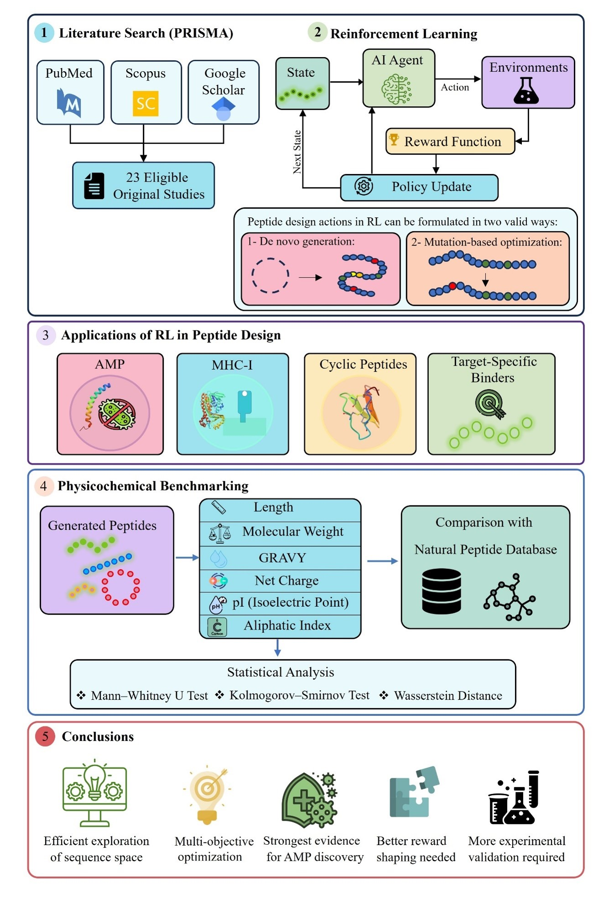

# RL-Peptide-Property-Benchmarking

This repository contains the code and benchmarking output associated with the manuscript:

**Reinforcement Learning in Peptide Design: A Systematic Review and Original Property-Based Benchmarking Analysis of Generated Sequences**

## Overview

The repository provides a reproducible property-based benchmarking workflow for comparing peptide sequences generated by reinforcement learning (RL) and RL-inspired methods with natural peptide reference sets.

The benchmarking analysis evaluates six physicochemical properties:

- Sequence length
- Molecular weight
- GRAVY (grand average of hydropathicity)
- Isoelectric point (pI)
- Net charge at pH 7.0
- Aliphatic index

Generated peptides are analyzed across four categories:

- Antimicrobial peptides (AMPs)
- MHC-binding peptides
- Cyclic/macrocyclic peptides
- Mixed/other peptide sets

## Repository Contents

- `RL-Peptide-Property-Benchmarking.ipynb`  
  Main Google Colab/Jupyter notebook containing the complete benchmarking pipeline.

- `peptide_benchmarking_report.html`  
  Interactive HTML report containing benchmarking tables, statistical comparisons, distribution plots, and model/strategy rankings.

- `graphical_abstract.jpg`  
  Graphical overview of the systematic review, RL peptide-design workflow, benchmarking analysis, and main conclusions.

- `requirements.txt`  
  Main Python packages used by the notebook.

- `CITATION.cff`  
  Citation metadata for the repository.

## Benchmarking Workflow

The notebook performs two complementary analyses.

### 1. Literature-range compliance

Generated peptides are evaluated against literature-derived physicochemical ranges. Compliance is reported as the percentage of sequences falling within the applicable range.

### 2. Distributional comparison with natural peptides

Generated peptide distributions are compared with natural reference distributions using:

- Descriptive statistics
- Mann–Whitney U test
- Kolmogorov–Smirnov test
- Normalized Wasserstein distance
- Percentage of generated values falling within the natural 5th–95th percentile interval

Analyses are performed separately at the individual-model level and the generation-strategy level.

## Sequence Quality Control

Only sequences composed entirely of the 20 standard proteinogenic amino acids are retained for quantitative physicochemical analysis.

If a sequence contains a non-canonical residue or otherwise invalid amino-acid symbol, the entire sequence is excluded from benchmarking and logged for traceability.

## Natural Reference Sets

Natural peptide reference sets consist of 100 sequences per primary peptide category and were derived from:

- APD6 for antimicrobial peptides
- IEDB for MHC-binding peptides
- CycPeptMPDB for cyclic/macrocyclic peptides

Equal-sized reference subsets were used to provide a standardized basis for comparison across peptide classes.

## Running the Notebook

The notebook is designed for use in Google Colab.

1. Open `RL-Peptide-Property-Benchmarking.ipynb` in Google Colab.
2. Run the notebook cells in order.
3. Upload the requested FASTA files when prompted.
4. The workflow calculates physicochemical properties, performs statistical analyses, generates plots, and exports an HTML report.

For generated peptide FASTA files, headers should identify the model and peptide type in the format expected by the notebook.

## Statistical Notes

- Statistical tests are performed only for groups containing at least three sequences.
- Reported p-values are unadjusted for multiple comparisons and should be interpreted as exploratory.
- Model-level comparisons describe the available/reported generated sequence sets rather than complete model-output distributions.
- Sequence-based physicochemical calculations for cyclic peptides do not explicitly model covalent cyclization or terminal modifications.

## Associated Manuscript

**Fereshteh Noroozi Tiyoula, Marzieh Gholami, Shohreh Ariaeenejad, Kaveh Kavousi**

*Reinforcement Learning in Peptide Design: A Systematic Review and Original Property-Based Benchmarking Analysis of Generated Sequences*

Publication details and DOI can be added after acceptance/publication.

## Citation

If you use this code or benchmarking workflow, please cite the associated manuscript and this repository.

## License

This project is licensed under the Apache License 2.0. See the LICENSE file for details.
